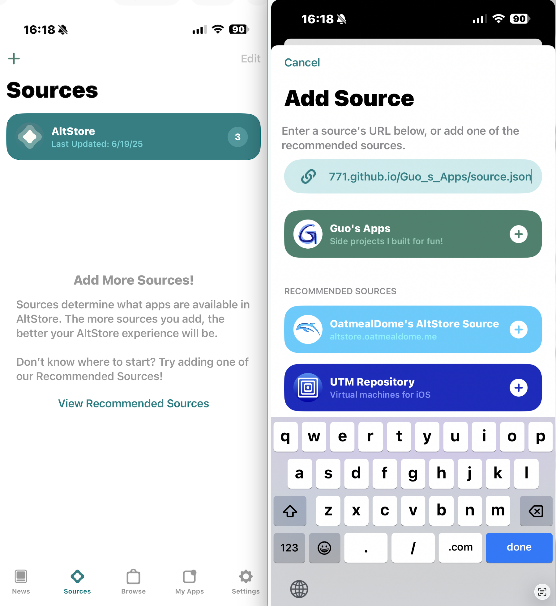

# Guo_s_Apps  
Guo's Source  

---

## 一、安装 AltServer

1. 在 Mac 或 PC 的浏览器中访问：  
   [https://altstore.io](https://altstore.io)

2. 向下滚动至页面底部，在 **AltStore Classic** 栏选择适合系统的 **Mac** 或 **Windows** 版本进行下载。  
   注意：此处 **不是 AltStore PAL 版本**。  

<p align="center">
  
</p>

---

## 二、安装 AltStore 到 iPhone

3. 使用数据线将 iPhone 连接到电脑，启动 **AltServer** 并通过它安装 **AltStore**。  
   AltServer 会在后台运行，可在电脑状态栏中找到其图标。  
   首次安装时，系统会要求输入 Apple ID 与密码（普通 ID 即可，仅用于签名应用）。

**提示：** Mac 与 PC 均可通过有线或同一 Wi-Fi 连接。  

<div align="center">
  
  
</div>

4. iPhone 上成功安装 AltStore 后，前往：  
   **设置 → 通用 → VPN 与设备管理 → 开发者 App → 信任 AltStore**

---

## 三、添加自定义 Source

5. 打开 iPhone 上的 **AltStore**，进入 **Sources** 界面，点击左上角 **“+”** 添加 Source：  

```bash
guoran7771.github.io/Guo_s_Apps/source.json
```


6. 点击 **Guo's Apps → Add Source**。

<p align="center">

</p>

7. 返回 Source 界面，选择 **Guo's Apps**，即可查看并下载所有自制 App。

<p align="center">

</p>

---

## 四、原理说明

通过 **AltStore** 可以安装由我制作并公开发布在 GitHub 上的未签名 `.ipa` 文件：  
[https://github.com/GuoRan7771/Guo_s_Apps](https://github.com/GuoRan7771/Guo_s_Apps)

系统会使用安装在电脑上的 **AltServer** 以你的 Apple ID 进行签名，有效期为 7 天。  
要持续使用这些应用，需每隔不超过 7 天，将电脑与手机连接（Wi-Fi 或有线）以续签。

---

## 五、目前可用应用

- **KuaiJi**  
一款纯本地账本应用，支持 AA 分账、个人账户管理及蓝牙/Wi-Fi 同步。  
GitHub 仓库：  
[https://github.com/GuoRan7771/KuaiJi_IOSApp](https://github.com/GuoRan7771/KuaiJi_IOSApp)
