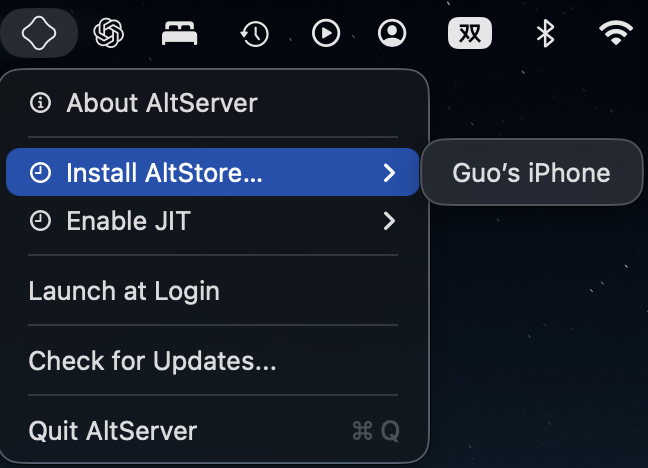

<p align="center">
  <b>Language / Langue / 语言 :</b>
  <b>English</b> |
  <a href="README.md">中文</a> |
  <a href="README_FR.md">Français</a>
</p>

# Guo_s_Apps  
Guo's Source  

---

## 1. Install AltServer

1. On your Mac or PC, visit:  
   [https://altstore.io](https://altstore.io)

2. Scroll down to the bottom of the page, find **AltStore Classic**, and download the **Mac** or **Windows** version that matches your system.  
   Note: This is **not** the AltStore PAL version.  

<p align="center">
  
</p>

---

## 2. Install AltStore on iPhone

3. Connect your iPhone to your computer via cable. Launch **AltServer** and use it to install **AltStore** on your device.  
   AltServer runs in the background, so you can find its icon in the system status bar.  
   During the first installation, you’ll be asked for your Apple ID and password (any regular Apple ID works; it’s only used for app signing).

**Tip:** Your Mac or PC can connect to the iPhone either via cable or the same Wi-Fi network.  

<div align="center">
  
  
</div>

4. Once AltStore is installed on your iPhone, go to:  
   **Settings → General → VPN & Device Management → Developer App → Trust AltStore**

---

## 3. Add Custom Source

5. Open **AltStore** on your iPhone, go to the **Sources** tab, tap the **“+”** button in the upper-left corner, and enter:  

```bash
guoran7771.github.io/Guo_s_Apps/source.json
```

6. Tap **Guo's Apps → Add Source**.

<p align="center">
  
</p>

7. Return to the **Sources** tab and open **Guo's Apps** to view and download all available apps.

<p align="center">
  
</p>

---

## 4. How It Works

With **AltStore**, you can install unsigned `.ipa` app packages that I’ve created and published publicly on GitHub:
[https://github.com/GuoRan7771/Guo_s_Apps](https://github.com/GuoRan7771/Guo_s_Apps)

AltServer on your computer signs the apps with your Apple ID. Each signature is valid for 7 days.
To continue using the apps, you must reconnect your iPhone to your computer (via Wi-Fi or cable) and **re-sign** them every 7 days or less.

A bit tedious?
~~(Don’t blame me—blame Apple. These are their rules.)~~

---

## 5. Available Apps

* **KuaiJi**
  A fully local accounting app supporting AA expense splitting, personal account management, and Bluetooth/Wi-Fi sync.
  GitHub Repository:
  [https://github.com/GuoRan7771/KuaiJi_IOSApp](https://github.com/GuoRan7771/KuaiJi_IOSApp)
