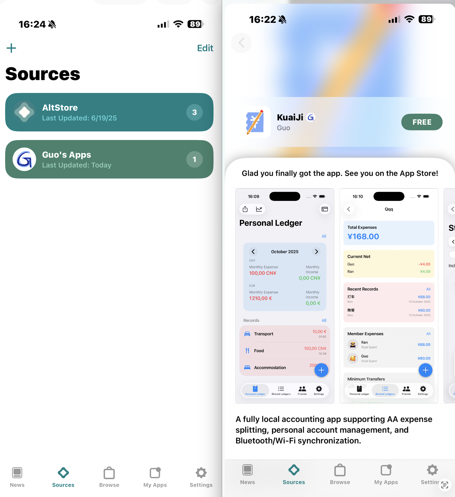

<p align="center">
  <b>Langue / Language / 语言 :</b>
  <b>Français</b> |
  <a href="README.md">中文</a> |
  <a href="README_EN.md">English</a>
</p>

# Guo_s_Apps  
Source de Guo  

---

## 1. Installation d’AltServer

1. Sur votre Mac ou PC, ouvrez le site :  
   [https://altstore.io](https://altstore.io)

2. Faites défiler la page jusqu’en bas, puis, dans la section **AltStore Classic**, téléchargez la version correspondant à votre système (**Mac** ou **Windows**).  
   Attention : il ne s’agit **pas** de la version AltStore PAL.  

<p align="center">
  
</p>

---

## 2. Installation d’AltStore sur iPhone

3. Connectez votre iPhone à l’ordinateur à l’aide d’un câble, lancez **AltServer** puis installez **AltStore** sur votre appareil.  
   AltServer s’exécute en arrière-plan, vous pouvez le trouver dans la barre d’état.  
   Lors de la première installation, il vous sera demandé d’entrer votre identifiant Apple et votre mot de passe (un identifiant Apple ordinaire suffit, il sert uniquement à **signer** l’application).

**Astuce :** le Mac ou le PC peut être relié par câble ou via le même réseau Wi-Fi.  

<div align="center">
  
  
</div>

4. Une fois AltStore installé sur l’iPhone, allez dans :  
   **Réglages → Général → VPN et gestion de l’appareil → App du développeur → Faire confiance à AltStore**

---

## 3. Ajouter une Source personnalisée

5. Ouvrez **AltStore** sur l’iPhone, accédez à l’onglet **Sources**, touchez le bouton **“+”** en haut à gauche et entrez :  

```bash
guoran7771.github.io/Guo_s_Apps/source.json
```

6. Appuyez sur **Guo's Apps → Add Source**.

<p align="center">
  
</p>

7. Revenez à la page **Sources**, sélectionnez **Guo's Apps**, et vous verrez la liste complète des applications disponibles.

<p align="center">
  
</p>

---

## 4. Explication du fonctionnement

Avec **AltStore**, vous pouvez installer des fichiers `.ipa` non signés que j’ai développés et publiés sur GitHub :
[https://github.com/GuoRan7771/Guo_s_Apps](https://github.com/GuoRan7771/Guo_s_Apps)

**AltServer** installé sur votre ordinateur signe les applications avec votre identifiant Apple.
Chaque signature est valable **7 jours**.
Pour continuer à utiliser ces applications, vous devez reconnecter votre iPhone à l’ordinateur (Wi-Fi ou câble) afin de **renouveler la signature** tous les 7 jours ou moins.

Un peu contraignant ?
~~(Ne me blâmez pas, blâmez Apple : ce sont leurs règles.)~~

---

## 5. Applications disponibles

* **KuaiJi**
  Application de comptabilité entièrement locale, prenant en charge le partage des dépenses (AA), la gestion de comptes personnels et la synchronisation Bluetooth/Wi-Fi.
  Dépôt GitHub :
  [https://github.com/GuoRan7771/KuaiJi_IOSApp](https://github.com/GuoRan7771/KuaiJi_IOSApp)
